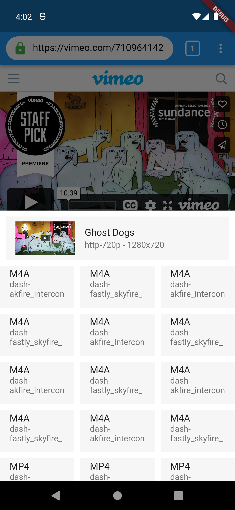

# 关于视频下载器

## 功能概览：

提供超1000+个视频网站非版权视频的下载；支持常规视频文件下载更支持流媒体文件下载如m3u8、hls等；应用是跨平台的，目前已经完成Android设备核心功能，后期完善苹果设备适配。

Provide downloads of non copyright videos from more than 1000 video websites; Support regular video file downloading and streaming media file downloading, such as m3u8, HLS, etc; The application is cross platform. At present, the core functions of Android devices have been completed, and Apple device adaptation will be improved in the later stage.

## 感谢各开源项目：

正是有了诸如: [youtube-dl](https://github.com/ytdl-org/youtube-dl)等大量开源项目的贡献，才诞生了本应用。再次站在前人的肩上。

# 特色介绍

youtube-dl服务部署于服务端，可以随时进行服务更新，保证解析的成功率；

内置浏览器，既可以浏览视频网站一键下载视频，同时也是一个功能齐全的跨平台浏览器；

除了支持常规视频文件下载，更支持流媒体文件播放下载，如m3u8、hls等；

## 预览图

    

# TODO & DONE:

- [ ] 适配ios端
- [ ] 支持合并音频和视频后下载(实验性)
- [ ] 丰富下载列表功能
- [ ] 复制视频文件到手机相册
- [ ] 内置播放器开发
- [ ] 多语言翻译，打算贡献翻译的可以联系
- [ ] 其他功能想到再补充，用户也可以提出
- [x] 内置跨平台浏览器
- [x] 下载列表、下载管理核心功能
- [x] 服务端解析目标网页视频
- [x] 对于有ip校验的网站支持经过服务器下载
# FAQ：
## 应用为什么不支持youtube下载?
因为我们需要上架Googleplay，所以剔除了youtube。需要的用户可以直接访问我们的WEB网站：[VideosDownloader.net](https://www.videosdownloader.net/)

## 为什么无法从一些网站下载视频（列如：Dailymotion，Pornhub等）

有些网站会为每个 IP 地址生成一个唯一的视频 URL。使用本应用时，会为我们的服务器 IP 地址生成 URL，您的计算机不允许使用它。（众所周知，Vimeo YouTube 视频也会发生这种情况。）

您可以通过服务器启用流式视频（见下图）。请注意，这会占用服务器上的大量资源，为了可持续发展该功能后续可能仅供订阅付费用户使用。

## 如何下载m3u8视频

你需要启用流式传输，打开按钮(见上图)

## 下载的视频有一个奇怪的名字，比如videoplayback.mp4

我们的应用会根据你的下载链接尝试给下载文件自动重命名。

如果您启用流式传输（见上图），我们可以自动重命名视频。

## 为什么会下载出错或者下载缓慢

如果下载的视频无需开启流式传输，请检查您的网络和视频网站所在的服务器连接情况

如果开启了流下载，请确保您的网络和我们服务器连接状况良好。

## 如何下载我所在国家/地区不可用的视频

1，如果视频网站被你所在的国家/地区屏蔽了，您可能需要代理访问，请自行搜索解决

2，如果视频网站没有被你所在的国家/地区屏蔽，则可以在启用流式传输的情况下下载（见上图）。

## 启用了流式传输，为何下载速度缓慢或者无法下载

流式传输会消耗大量服务器宽带和大量占用服务器资源。如果你可以顺利下载，请勿开启！

后续可能流式传输以及视频音频文件合并功能仅向订阅用户开放。

# 立即体验：

Google Play Store
：链接: [https://play.google.com/store/apps/details?id=net.videosdownloader.videodown](https://play.google.com/store/apps/details?id=net.videosdownloader.videodown)

Releases: [https://github.com/shipinbaoku/videosdownloader/releases/download/6.0.1/videosdownloader6.0.1.apk](https://github.com/shipinbaoku/videosdownloader/releases/download/6.0.1/videosdownloader6.0.1.apk)
